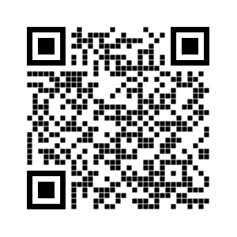

# F&amp;M Sustainability Workshop Series: Technology
Thursday, March 21st, 2024

## Definition Of Terms
- *Sustainable* _(adjective)_
  - Original: bearable, capable of being endured
  - Modern: capable of being maintained at a certain rate or level
  - In Context: "minimized degradation" or "avoidance of long-term depletion or exploitation"
- *Technology* _(noun)_
  - Original: systematic treatment
  - Modern: combined application of science and art in practical ways in industry
  - In Context: "digital communication" or "computing"
 
## Personal Technology Audit
[Cal Newport](https://calnewport.com/writing/) described a method for better understanding technology's impact on your life and identifying areas you might want to cut back or make changes.

1. *Identify all your digital tools and services:* Make a comprehensive list of all the digital tools, apps, social media platforms, websites, and services that you use on a regular basis.
   - This could include everything from social media apps to email clients to productivity tools.
   - It might help to categorize them based on their purpose.
2. *Evaluate the value of each tool:* For each digital tool or service, consider its value in your life.
   - Ask yourself questions like: Does this tool serve a clear purpose or bring me genuine value?
   - How does using this tool contribute to my overall well-being or goals?
3. *Assess the costs:* Next, consider the costs associated with each tool.
   - This includes not only monetary costs (such as subscription fees) but also time and attention costs.
   - Reflect on how much time you spend using each tool and whether that time could be better spent elsewhere.
4. *Consider the alternatives:* Explore whether there are alternative tools or methods that could serve the same purpose with less digital clutter or distraction.
   - This could involve finding simpler or more focused apps, reducing redundancy by consolidating tools, or even going without certain tools altogether.
5. *Decide what to keep, what to cut, and what to modify:* Based on your evaluation, decide which tools you want to keep using as they are, which ones you want to cut out entirely, and which ones you want to modify or use differently.
   - Be intentional about the role each tool plays in your life and how it aligns with your values and goals.
6. *Implement changes gradually:* Finally, start implementing the changes you've identified gradually.
   - This could involve deleting apps, unsubscribing from services, setting usage limits, or adopting new habits and routines.
   - Give yourself time to adjust to these changes and be mindful of how they impact your overall well-being and productivity.

## Reading List
- [Digital Minimalism: Choosing a Focused Life in a Noisy World](https://calnewport.com/writing/) by Cal Newport
- [Twitter and Tear Gas: The Power and Fragility of Networked Protest](https://www.twitterandteargas.org/) by Zeynep Tufekci
- [Drawdown: The Most Comprehensive Plan Ever Proposed to Reverse Global Warming](https://drawdown.org/the-book) by Paul Hawken
- [Life In Code: A Personal History Of Technology](https://us.macmillan.com/books/9780374711412/lifeincode) by Ellen Ullman
- [Code: The Hidden Language of Computer Hardware and Software](https://codehiddenlanguage.com/) by Charles Petzold
- [The Myth of the Machine, vol 1: Technics and Human Development](https://en.wikipedia.org/wiki/The_Myth_of_the_Machine) by Lewis Mumford
- [The Technological Socity](https://en.wikipedia.org/wiki/The_Technological_Society) by Jacques Ellul
- [Seeing Like A State: How Certain Schemes to Improve the Human Condition Have Failed](https://yalebooks.yale.edu/book/9780300078152/seeing-like-a-state/) by James C. Scott

